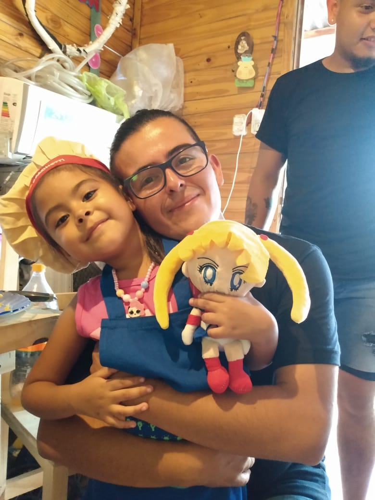

# Presentación

## Estudiante: _JONATAN LEZCANO_
Buena soy estudiante de la UNQ, hace varios años atras empecé la carrera (en el 2012 ) luego la tuve que dejar y en el 2018 retomé por suerte, no me está yendo tan bien como esperé pero bueno hago lo que puedo.
Actualmente soy operario en una fabrica de rollos de papel "Roll Paper" ya hace 10 años
convivo con mi familia que está compuesta por mi mujer Karina y mi nena Yanina y la gata de mi nena 
Me gusta mucho jugar a la pelota, video juegos (soy muy vicio) juego desde family hasta play 4 lo que de 
tambien actualmente estoy jugando de forma competitiva a yugioh (que es un juego de cartas)
Hice un curso de PHP en la UTN de manera a distancia, me gustó mucho, si bien aun no hice nada con ese curso tengo varios proyectos junto con un amigo asi que bueno la idea está jajajaja
Bueno espero que me vaya bien en la cursada me interesa mucho esta materia de verdad y bueno le voy a poner muchas ganas

Esta práctica está pensada para ir familiarizándose con la plataforma de GitHub, herramienta que vamos a estar usando para las entregas de TPs.

Consiste en hacer 2 simples tareas:
- [x] **Editar este archivo completando tu nombre**. Para eso basta con 
  - tocar el lapicito de arriba a la derecha de este archivo 
  - editar el archivo
  - agregar un nombre y descripción al _commit_ (cambio) que vamos a subir. Este paso es opcional pero recomendable.
  - darle al botón de **Commit** para subir los cambios al repositorio.

- [ ] **Subir una foto tuya**. Para esto pueden usar la opción para subir archivos que es bastante intuitiva.
Una vez seleccionado el archivo hay que crear el _commit_ para subir los cambios, similar al paso anterior.

- [ ] **Agregar algo sobre vos**. Editá el README nuevamente para agregar algo sobre vos. Podés borrar y agregar lo que quieras. Dejalo como te guste!
]
- [ ] **Mirá la presentación de tus compas**. Una vez que terminaste, andá al [Github del curso](https://github.com/obj1unq) y mirá las presentaciones de tus compas. Haceles comentarios en la parte de _Issues_, despus volvé y respondé los issues de tu presentación.

